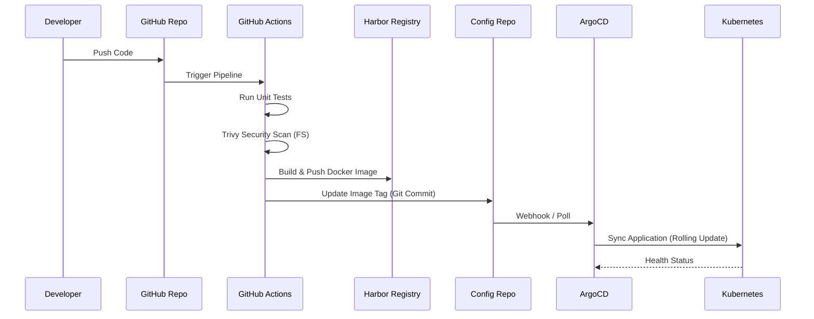

# Phoenix Booking System - Architecture & Design

## 1. High-Level Architecture

The system is built on a **Microservices Architecture**, ensuring scalability, fault isolation, and independent deployment.

```mermaid
graph TD
    Client[Client (Browser/Mobile)] -->|HTTPS| ALB[AWS Load Balancer]
    ALB -->|Traffic| IG[Istio Ingress Gateway]
    
    subgraph "Kubernetes Cluster (Phoenix App Namespace)"
        IG -->|mTLS| GW[API Gateway Service]
        
        GW -->|/auth| ID[Identity Service]
        GW -->|/hotels| HS[Hotel Service]
        GW -->|/booking| BS[Booking Service]
        GW -->|/search| SS[Search Service]
        
        BS -->|Async Event| NS[Notification Service]
        
        ID -.->|OIDC| Asgardeo[Asgardeo IDP]
        
        HS --> DB1[(Hotel DB)]
        BS --> DB2[(Booking DB)]
        ID --> DB3[(User DB)]
    end
    
    subgraph "Observability & Security"
        Prometheus -->|Scrape| IG
        Prometheus -->|Scrape| GW
        Prometheus -->|Scrape| HS
        Grafana -->|Query| Prometheus
        FluentBit -->|Logs| OpenSearch
        Vault -->|Secrets| GW & HS & BS
    end
```

## 2. Kubernetes Deployment & Network

The infrastructure is provisioned on AWS using **Terraform** and bootstrapped with **Kubeadm**.

```mermaid
graph TB
    subgraph "AWS VPC (10.0.0.0/16)"
        subgraph "Public Subnet (10.0.1.0/24)"
            Master[K8s Master Node]
            Worker1[Worker Node 1]
            Worker2[Worker Node 2]
            ALB[Application Load Balancer]
        end
        
        ALB -->|Port 80/443| Worker1
        ALB -->|Port 80/443| Worker2
    end
    
    subgraph "Zero-Trust Security Layer"
        Istio[Istio Service Mesh]
        mTLS[Mutual TLS (STRICT)]
        Vault[HashiCorp Vault Agent]
    end
    
    Master -->|Control Plane| Worker1
    Master -->|Control Plane| Worker2
```

**Security Measures:**
*   **Network Policies**: Default deny all ingress; allow only specific service-to-service paths.
*   **mTLS**: Enforced via `PeerAuthentication` (STRICT mode) in the `phoenix-app` namespace.
*   **Secrets**: Injected at runtime via Vault Agent Sidecar; no secrets in environment variables.

## 3. CI/CD Pipeline

We use a **GitOps** approach with GitHub Actions and ArgoCD.



## 4. Technology Stack

| Component | Technology | Justification |
| :--- | :--- | :--- |
| **Orchestration** | Kubernetes (Kubeadm) | Industry standard, self-healing, declarative. |
| **Service Mesh** | Istio | Traffic management, mTLS, observability. |
| **Identity** | Asgardeo | OIDC/OAuth2 compliant managed identity provider. |
| **Secrets** | HashiCorp Vault | Centralized secret management, dynamic secrets. |
| **CI/CD** | GitHub Actions + ArgoCD | Separation of CI (Build) and CD (Deploy/GitOps). |
| **Monitoring** | Prometheus + Grafana | Metric collection and visualization. |
| **Logging** | OpenSearch + Fluent Bit | Centralized log aggregation. |
